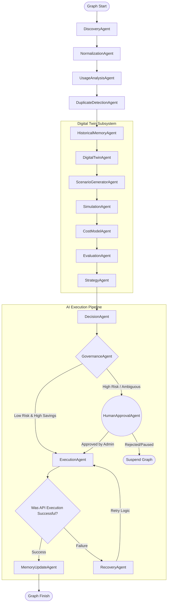

# FinTraxion — Autonomous SaaS Optimization Agent (Enterprise Edition)

This repository contains a production-grade backend and an internal-only dashboard demonstrating an **Enterprise Multi-Agent SaaS Optimization System**. The system autonomously discovers, analyzes, simulates, and executes cost-saving infrastructure and licensing changes.

Built with:
- **FastAPI** (API, SSE streaming, Independent Approvals)
- **LangGraph** (Explicit Multi-Agent orchestration, Shared Context, Governance routing)
- **Supabase** (Persistence, memory snapshots, highly detailed audit trails)
- **FAISS** (Vector similarity search for vendor normalization)
- **Gemini Embeddings & Strong LLMs** (With fallback rules & Graceful Degradation)
- **React + TailwindCSS** (Live dashboard, dynamic simulation graphs, tabbed architecture)

---

## 🏗 Enterprise Multi-Agent Architecture

The workflow leverages a robust, object-oriented **14-Agent Architecture**, split cleanly into two distinct, high-impact subsystems:

### Subsystem 1: Predictive Cost Simulation (The Digital Twin)
This subsystem runs invisibly *before* the DecisionAgent can make its final AI Recommendations. Instead of letting the LLM guess what is safe, this engine mathematically forces outcomes.
1. **`DigitalTwinAgent`**: Synthesizes active SaaS environments into an immutable sandbox model.
2. **`ScenarioGeneratorAgent`**: Programmatically generates theoretical "What-If" models based on detected structural vulnerabilities.
3. **`SimulationAgent`**: Mutates the digital twin within isolated memory blocks to test futures.
4. **`CostModelAgent`**: Deduce the exact projected capital savings recursively tracking "Before vs After" deltas.
5. **`EvaluationAgent`**: Computes an "execute-ability" score (savings × confidence) and records theoretical outcomes.
6. **`StrategyAgent`**: Actively constrains the broader orchestrator by injecting the mathematically superior future state directly into the global execution graph.

### Subsystem 2: The SaaS AI Orchestrator
This is the core pipeline responsible for ingesting live data, reasoning through constraints, flagging operators, and executing infrastructure operations.
7. **`DiscoveryAgent`**: Ingests unstructured footprint data across Identity Providers.
8. **`NormalizationAgent`**: Uses FAISS embeddings and fuzzy fallbacks to map messy vendor strings into canonical entities.
9. **`UsageAnalysisAgent`**: Synthesizes active-seat data arrays to isolate non-utilization limits.
10. **`DuplicateDetectionAgent`**: Evaluates semantic similarity graphs to identify functionally overlapping tools.
11. **`HistoricalMemoryAgent`**: Fetches long-term context arrays from Supabase to prevent the LLM from making repetitive decisions over historic timelines.
12. **`DecisionAgent`**: The core LLM engine. It ingests the combined context alongside the mathematical constraints forced by the *StrategyAgent* to output deterministic optimization recommendations.
13. **`GovernanceAgent`**: Hard-coded procedural policy layer. It determines routing paths via Savings & Risk heuristic calculations (Auto-Execute vs Human-Approval Required).
14. **`HumanApprovalAgent`**: Physically suspends LangGraph execution, locking state until administrative override is received via the Enterprise UI.
15. **`ExecutionAgent`**: Mocks API actions against third-party endpoints. Integrates **Graceful Degradation** for resilient failure handling.
16. **`RecoveryAgent`**: Processes nested exception recovery strategies via execution loops.
17. **`MemoryUpdateAgent`**: Finalizes graph termination arrays mapped against Postgres datasets.

---

### Visualization of the Graph Flow



---

## 💻 Frontend (Internal Control Panel)

The React Enterprise UI has been refactored into cleanly isolated environments:

- **AI Orchestrator Pipeline Tab**: Real-time execution visualization, execution logs, human-approval resolution queues, and active infrastructure mapping. 
- **Digital Twin Simulations Tab**: A dedicated analytic sandbox to review the exact "What-if" mathematical projections that the system processed. Includes dynamically rendering CSS-native *Before vs After* horizontal bar graphs to definitively prove operational feasibility.

---

## ⚙️ Setup Instructions

### 1) Configure Environment Variables
Create a `.env` in the repository root:
- `SUPABASE_URL`
- `SUPABASE_SERVICE_KEY`
- `GEMINI_API_KEY`

Optional:
- `GEMINI_MODEL_STRONG` (default `gemini-1.5-flash`)
- `GEMINI_EMBED_MODEL` (default `models/text-embedding-004`)
- `SIMULATE_FAILURES` (default `true` — controls the 30% execution-agent failure rate)

### 2) Bootstrap Database
Run the schema seeder to prepare your Mock Database in Supabase:
```bash
python backend/scripts/seed_supabase.py
```

### 3) Start the System
**Backend FastAPI Server:**
```bash
cd backend
uvicorn main:app --reload --port 8000
```
Interactive Swagger UI will be available at: `http://localhost:8000/docs`

**Frontend React/Vite Dashboard:**
```bash
cd frontend
npm install
npm run dev
```
Dashboard will be available at: `http://localhost:5173`
