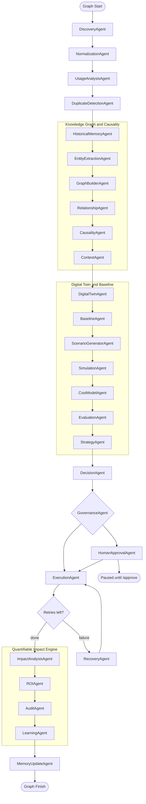

# FinTraxion — Autonomous SaaS Optimization Agent (Enterprise Edition)

This repository contains a production-grade backend and an internal-only dashboard demonstrating an **Enterprise Multi-Agent SaaS Optimization System**. The system autonomously discovers, analyzes, simulates, and executes cost-saving infrastructure and licensing changes, with **explainable causality**, **quantifiable business impact**, and a closed **predicted-vs-actual** feedback loop.

Built with:
- **FastAPI** (API, SSE streaming, independent approvals)
- **LangGraph** (explicit multi-agent orchestration, shared state, governance routing)
- **Supabase** (persistence, memory snapshots, audit trails, impact tables)
- **FAISS** (vector similarity search for vendor normalization)
- **NetworkX** (in-memory enterprise knowledge graph for relationships and root-cause context)
- **Gemini Embeddings & Strong LLMs** (with fallback rules and graceful degradation)
- **React + TailwindCSS** (live dashboard, simulation views, causal and impact tabs)

---

## Enterprise multi-agent architecture

The workflow is organized into **four** major subsystems (20+ named agents). Execution order is linear in LangGraph unless noted for conditional routing (governance, human approval, recovery).

### Subsystem 1 — SaaS discovery and analysis
Core data ingestion and duplicate detection.
- **`DiscoveryAgent`**, **`NormalizationAgent`**, **`UsageAnalysisAgent`** (node id `enrichment`), **`DuplicateDetectionAgent`**, **`HistoricalMemoryAgent`**

### Subsystem 2 — Enterprise knowledge graph and causality (NetworkX)
Runs **after** historical memory and **before** the digital twin. Builds a serialized graph in `state["knowledge_graph"]`, causal signals in `state["graph_alerts"]`, and **`state["graph_context"]`** (root cause, affected services, risk factors, per-recommendation hints) for the **DecisionAgent** and audit surfaces.
1. **`EntityExtractionAgent`** — entities from usage, duplicates, and discovery payloads (rules; structured data).
2. **`GraphBuilderAgent`** — service, team, cost, and usage-metric nodes.
3. **`RelationshipAgent`** — edges such as `uses`, `contributes_to_cost`, `overlaps_with`, `depends_on`.
4. **`CausalityAgent`** — heuristics and graph neighborhood analysis; anomaly-style alerts (e.g. cost vs utilisation).
5. **`ContextAgent`** — packages **`graph_context`**; persists graph snapshot keys in Supabase memory.

The **DecisionAgent** consumes `graph_context` and enriches recommendations with causal **`reason`**, **`source`**, and **`cause_explanation`** where applicable. **Simulation** can attach **`cascade_impact`** from graph dependencies.

### Subsystem 3 — Predictive cost simulation (digital twin)
Runs **after** the knowledge-graph pipeline. **`BaselineAgent`** captures **`state["baseline_snapshot"]`** (pre-optimization monthly cost from the twin) for before/after and impact metrics.
1. **`DigitalTwinAgent`** — portfolio baseline model.
2. **`ScenarioGeneratorAgent`** — what-if scenarios (including overlap edges from the graph when relevant).
3. **`SimulationAgent`**, **`CostModelAgent`**, **`EvaluationAgent`**, **`StrategyAgent`** — deterministic scenarios, pricing deltas, ranking, best strategy fed into decisions.

### Subsystem 4 — Decision, governance, execution, and recovery
- **`DecisionAgent`**, **`GovernanceAgent`**, **`HumanApprovalAgent`**, **`ExecutionAgent`**, **`RecoveryAgent`**

**`ExecutionAgent`** emits **`state["execution_results"]`** (per action: predicted vs actual savings) for downstream impact analysis.

### Subsystem 5 — Quantifiable impact engine (post-execution)
Runs **after** a successful execution path (or when retries are exhausted): **`impact_analysis`** → **`roi`** → **`audit`** → **`learning`** → **`memory_update`**.

- **`ImpactAnalysisAgent`** — compares simulation/recommendation **predicted** savings to **realized** savings; **`state["impact_metrics"]`** includes `before_cost`, `after_cost`, `savings`, `predicted_savings`, `variance_predicted_vs_actual`, etc.
- **`ROIAgent`** — ROI multiple (vs estimated implementation cost) and **efficiency_gain** (% of baseline removed).
- **`AuditAgent`** — traceability; writes to Supabase memory and, when present, **`impact_metrics`** and **`impact_audit`** tables (see `backend/db/schema.sql`).
- **`LearningAgent`** — appends outcome signals to global memory (`learning:outcomes`) for calibration across runs.
- **`MemoryUpdateAgent`** — final persistence (recommendations, logs, impact snapshots, FAISS updates).

---

### Visualization of the graph flow (high level)



---

## API surface

The backend exposes a small set of HTTP routes; **new features do not add separate REST resources**—graph, causal, and impact data are part of the **same workflow** and returned on **`GET /status?run_id=...`** (alongside recommendations, `graph_context`, `impact_metrics`, `execution_results`, etc.).

| Method | Path | Purpose |
|--------|------|--------|
| POST | `/run` | Start workflow; returns `run_id` |
| GET | `/stream/{run_id}` | SSE log stream |
| GET | `/status` | Full run snapshot (`run_id` query param) |
| POST | `/approve` | Resume after human approval |
| GET | `/logs` | `actions_log` from Supabase |
| GET | `/health` | Health check |

See **`http://localhost:8000/docs`** for OpenAPI details.

---

## Frontend (internal control panel)

- **SaaS Optimization Agent** — workflow steps (including Knowledge Graph, Baseline, Impact, ROI, Audit, Learning, Memory), services, duplicates, recommendations, approval queue, execution logs with **predicted vs actual** when `execution_results` exist, and **Quantifiable impact** (ROI, efficiency, before/after, simulation vs execution variance, learning signal).
- **Causal analysis** — portfolio root-cause narrative, graph alerts, and per-recommendation causal audit fields.
- **Digital Twin Simulations** — ranked scenarios and savings from evaluation.

---

## Setup instructions

### 1) Configure environment variables
Create a `.env` in the repository root:
- `SUPABASE_URL`
- `SUPABASE_SERVICE_KEY`
- `GEMINI_API_KEY`

Optional:
- `GEMINI_MODEL_STRONG` (default `gemini-1.5-flash`)
- `GEMINI_EMBED_MODEL` (default `models/text-embedding-004`)
- `SIMULATE_FAILURES` (default `true` — controls the ~30% execution-agent failure rate)

### 2) Bootstrap database
Apply **`backend/db/schema.sql`** in the Supabase SQL editor (includes `memory`, `recommendations`, `actions_log`, **`impact_metrics`**, **`impact_audit`**, etc.). Then run the project seeder if you use it:

```bash
python backend/scripts/seed_supabase.py
```

### 3) Start the system
**Backend:**
```bash
cd backend
uvicorn main:app --reload --port 8000
```
Swagger UI: `http://localhost:8000/docs`

**Frontend:**
```bash
cd frontend
npm install
npm run dev
```
Dashboard: `http://localhost:5173`
